# CascadeTabNet: An approach for end to end table detection and structure recognition from image-based documents
ref: https://github.com/DevashishPrasad/CascadeTabNet/blob/master/README.md
###### Devashish Prasad, Ayan Gadpal, Kshitij Kapadni, Manish Visave, Kavita Sultanpure, CVPR2020

## Abstract
- In this paper, we present an improved deep learning-based end to end approach for solving both problems of **table detection** and **structure recognition** using a single Convolution Neural Network (CNN) model.

- We propose CascadeTabNet: a Cascade mask Region-based CNN High-Resolution Network (Cascade mask R-CNN HRNet) based model that **detects the regions of tables** and **recognizes the structural body cells from the detected tables** at the same time.

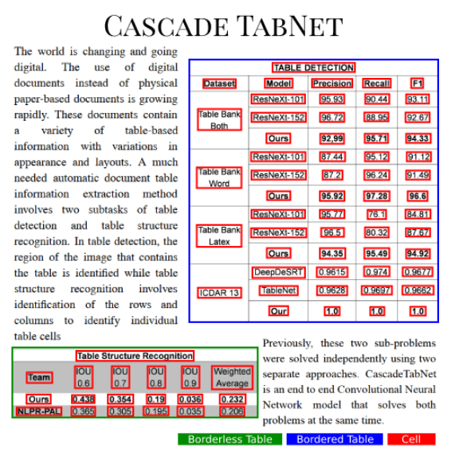

## CascadeTabNet: The presented approach
We try to focus on using a small amount of data effectively to achieve high accuracy results. Working towards this goal, our primary strategy includes:

- Using a **relatively complex but efficient CNN architecture** that attains high accuracy on object detection and segmentation benchmarking datasets as the main component in the approach. 
- Using an **iterative transfer learning approach** to train the CNN model gradually, starting from more general tasks and going towards more specific tasks. Performing iterations of transfer learning multiple times to extract the needful knowledge effectively from a small amount of data. 
- Strengthening the learning process by applying image transformation techniques to training images for **data augmentation**.

###  Model architecture
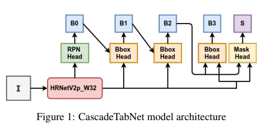

- **Cascade RCNN**

- **HRNetV2p**: The original architecture of HRNet was enhanced for semantic segmentation to form HRNetV2. And, then a feature pyramid was formed over HRNetV2 for object detection to form HRNetV2p.

CascadeTabNet is a three-staged Cascade mask R-CNN HRNet model. A backbone such as a ResNet-50 without the last fully connected layer is a part of the model that transforms an image to feature maps.

- As shown in figure 1, the image **”I”** is fed into the model. The backbone CNN HR NetV2p W32 transforms the image ”I” to feature maps. 
- The **”RPN Head”** (Dense Head) predicts the preliminary object proposals for these feature maps. 
- The **”Bbox Heads”** take RoI features as input and make RoI-wise predictions. 
- Each head makes two predictions as **bounding box classification scores** and **box regression points**.
- **”B”** denotes the bounding boxes predicted by the heads and, for simplicity, we do not show the classification scores in the figure. 
- The **”Mask Head”** predicts the masks for the objects and **”S”** denotes a segmentation output. At the inference, object detections made by ”Bbox Heads” are complemented with segmentation masks made by ”Mask Head”, for all detected objects.

### Iterative transfer learning
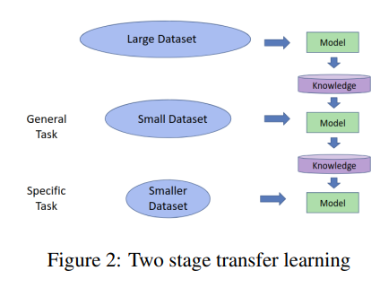

1. The **two-stage transfer learning strategy** is used to make a single model learn end to end table recognition using a small amount of data.
    - in the first iteration of transfer learning, we initialize our CNN model with the **pre-trained imagenet coco model weights** before training. After training, CNN successfully predicts the table detection masks for **tables** in the images.

    - in the second iteration, the model is again **fine-tuned on a smaller dataset** to accomplish even more specific task of predicting the **cell** masks in borderless tables along with detecting tables according to their types.

2. We create a **general dataset** for a general task of table detection. We add images of different types of documents like word and latex in this dataset. These documents contain tables of various types like bordered, semi-bordered and borderless.
    - A **bordered** table is one for which an algorithm can use just the line positions to estimate the cells and overall structure of the table.
    - If some of the lines are missing, it becomes difficult for a line detection based algorithm to separate the adjacent cells of the table. We call such a table as a **semi-bordered** table, in which some lines are not present.
    - And a **borderless** table is one which doesn’t have any lines.

3. This ew dataset contains slightly advanced annotations intimating the model to detect tables of two types with their labels (two classes) as **bordered**  and **borderless** (with borderless and semi-bordered), as well as predict borderless table cell masks (total three classes).

## Pipeline
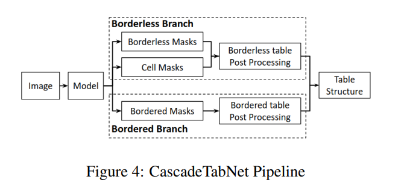

In the **bordered branch**, 
- A **conventional algorithm of line detection** is used to detect lines of bordered tables. 
- The cells are identified using the **line intersection points**. 
- And within each cell, the text regions are detected by using the **contourbased text detection algorithm**.

<!-- - We prefer not to train our model for bordered table cell segmentation masks prediction because using the line information from bordered tables is much easier and efficient to recognize the cells. -->

In the **borderless branch**, 
- We arrange the predicted cells detected inside the table into **rows** and **columns** based on their positions.
- We **estimate the missing table lines** using the positions of identified rows and columns. 
- Based on these lines, for undetected cells, we detect cells using a **contourbased text detection algorithm**. 

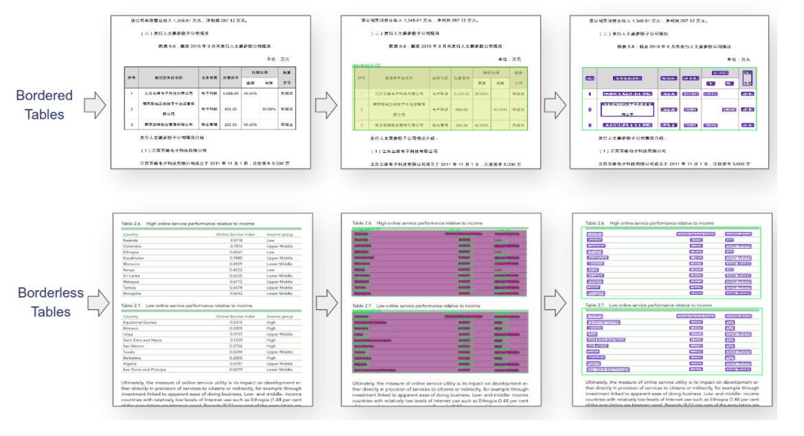

## Image Transformation and data augmentation
- Dilation transform
- Smudge transform

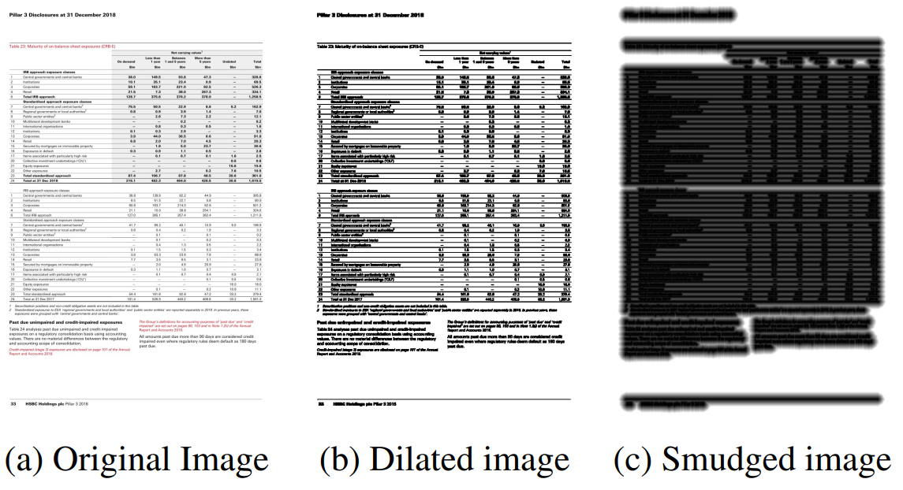

## Results and Analysis
For creating a General dataset for table detection task we merge three datasets of ICDAR 19 (cTDaR), Marmot and Github(sgrpanchal31/table-detection-dataset).

### Preliminary Analysis
Evaluation metrics for ICDAR 19 dataset are based on IoU (Intersection over Union) to evaluate the performance of **table region detection**. These results proved that both image transformation techniques for **data augmentation** help the model learn more effectively.
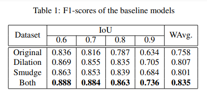

### Table detection evaluation
First, we fine-tune Cascade mask R-CNN HRNet on the **ICDAR 19** track A train set along with dilation transform augmentation, and the following results were obtained on the modern tack A test set.
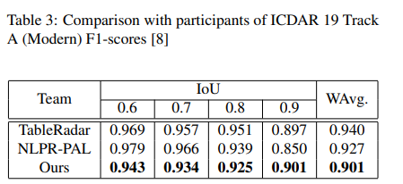

Evaluation metrics for **TableBank** dataset for table detection are based on, calculating the Precision, Recall, and F1.
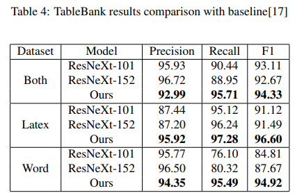

Evaluation metrics for **ICDAR 2013** is based on completeness and purity of the sub-objects of a table.
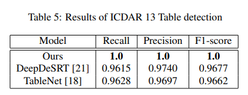

### Table structure recognition evaluation
For each cell, it is required to return the coordinates of a polygon defining the convex hull of the **cell’s contents**. 
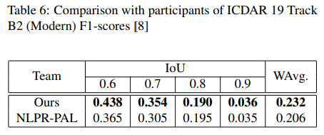

It predicts accurate cell masks for most of the borderless tables. For some images where some of the predictions for cells are missed by the model (5 c.), we correct it using line estimation and contour-based text detection algorithm. The model fails badly for some images (5 d.).
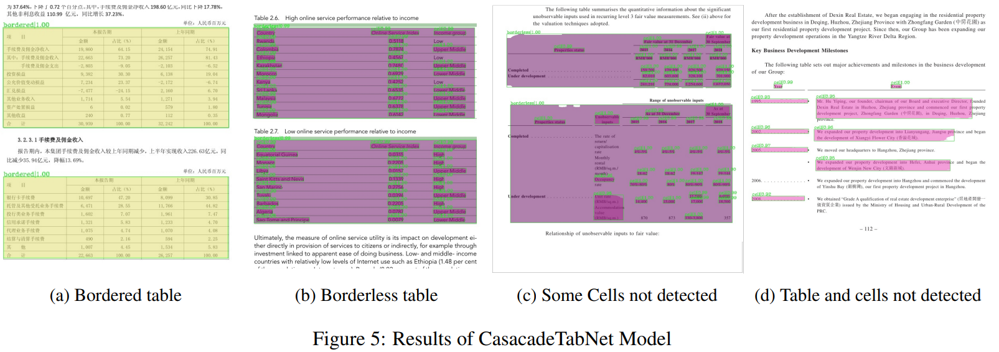