# Diffusion Models Beat GANs on Image Synthesis

> **Diffusion Models在圖像合成上擊敗了BigGAN**
DeepMind曾於2018年在一篇 ICLR 2019 論文中提出了BigGAN，當時一經發表就引起了大量關注， 很多學者都不敢相信AI竟能生成如此高質量的圖像，這些生成圖像的目標和背景都相當逼真，邊界也很自然。<!-- 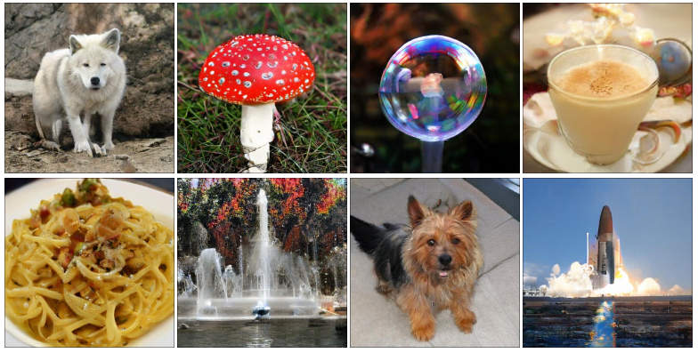 由BigGAN模型生成的512x512分辨率图像(ablated diffusion model, ADM) -->如今，Alex Nichol和Prafulla Dhariwal两位学者提出的扩散模型，在图像合成上终于可匹敌BigGAN。
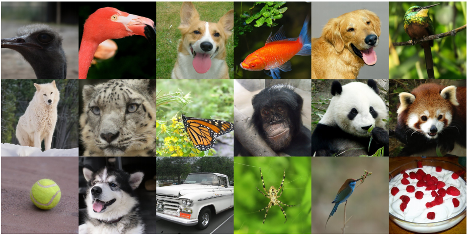
據PapersWithCode數據顯示，目前在ImageNet數據集的從64x64到512x512分辨率的圖像生成模型榜單中，本文提出的ADM模型全部佔據榜首。
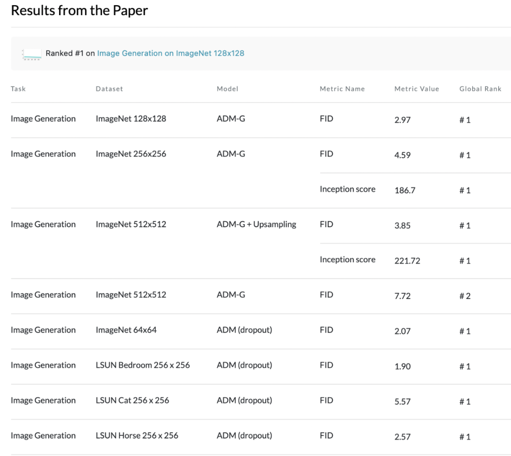

<!-- > **擴散模型生成器**
擴散模型是一類基於似然度的模型，最近被證明可以生成高質量的圖像，同時提供了理想的屬性，如更高的分佈覆蓋率，穩定的訓練目標和更好的可擴展性。這些模型通過逐步去除信號中的噪聲來生成樣本，其訓練目標可以表示為一個重新加權的變分下界(ELBO)。
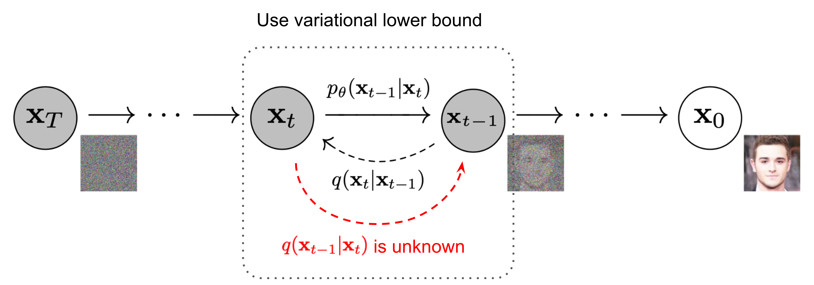
Nichol和Dhariwal發現，隨著計算量的增加，這些模型得到了可靠的改進，即使在高難度ImageNet256×256數據集上也能生成高質量的樣本。然而，該模型的FID仍然不能與BigGAN-deep相比，後者是目前這個數據集上最先進的技術。
研究人員假設擴散模型和GANs之間的差距至少在兩方面：第一，最近GAN文獻使用的模型架構已經被大量探索和改進；第二，GAN能夠權衡質量和多樣性，生成高質量的樣本，但不覆蓋整個分佈。如何將這些優勢應用到擴散模型？
研究者首先改進模型結構，然後設計一個以多樣性換取質量的方案。通過這些改進，實現了一個新的最先進的模型，在幾個不同的指標和數據集上超過了GANs。 -->

<!-- >**實驗結果**
為了在無條件圖像生成方面評估改進的模型架構，研究者在三個LSUN數據集類別（臥室、馬和貓）上訓練不同配置的擴散模型。為了評估分類器指導，研究者在128×128，256×256，512×512分辨率的ImageNet數據集上訓練條件擴散模型。 -->

>**最先進的圖像生成技術**
通過改進的架構，研究者已經在LSUN和ImageNet64×64圖像生成上獲得了最佳的性能。對於更高分辨率的ImageNet，研究者觀察到擴散模型大大超過最好的GANs。這些模型生成的圖像的感知質量接近GAN，同時保持了更高的分佈覆蓋率。
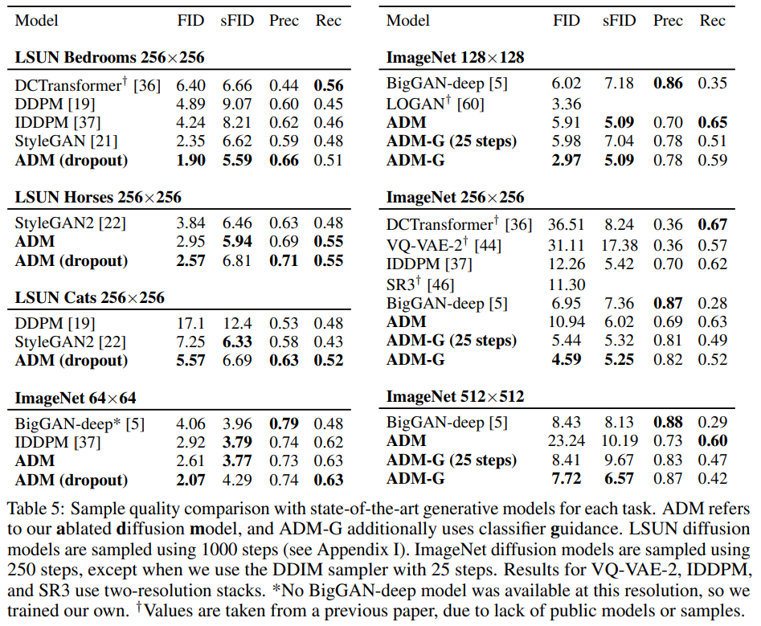
雖然樣本具有相似的感知質量，但擴散模型包含了比GAN更多的模式，比如放大的鴕鳥頭特寫，單只火烈鳥，不同方向觀察的芝士漢堡，以及一條沒有被人類抓著的馬口魚。
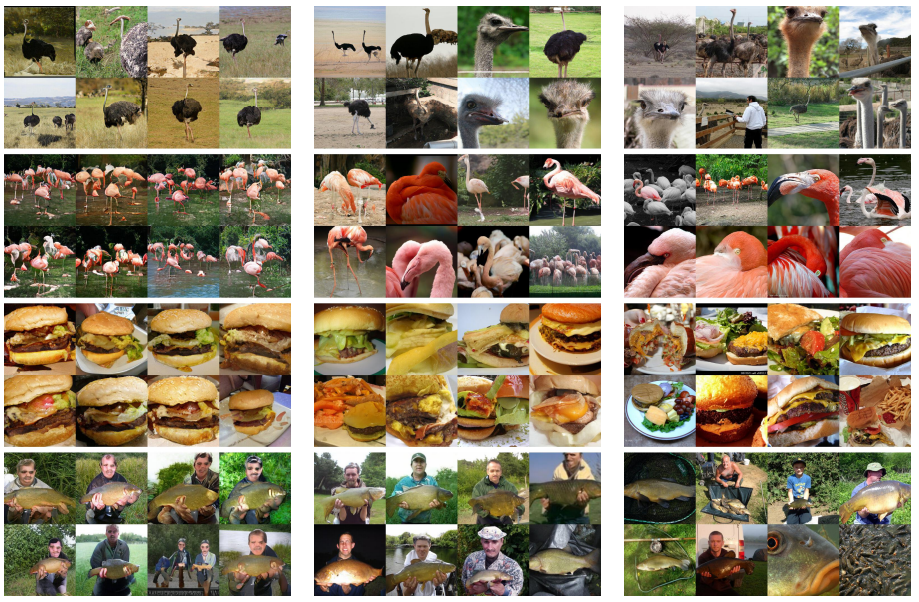
取自BigGAN-deep的樣本(FID6.95，左)，與取自擴散模型的樣本(FID4.59，中)和取自訓練集的樣本(右)。

>**What are Diffusion Models?**
[reference](https://lilianweng.github.io/lil-log/2021/07/11/diffusion-models.html)
So far, I’ve written about three types of generative models, GAN, VAE, and Flow-based models. They have shown great success in generating high-quality samples, but each has some limitations of its own. GAN models are known for potentially unstable training and less diversity in generation due to their adversarial training nature. VAE relies on a surrogate loss. Flow models have to use specialized architectures to construct reversible transform.
Diffusion models are inspired by non-equilibrium thermodynamics. They define a Markov chain of diffusion steps to slowly add random noise to data and then learn to reverse the diffusion process to construct desired data samples from the noise. Unlike VAE or flow models, diffusion models are learned with a fixed procedure and the latent variable has high dimensionality (same as the original data).
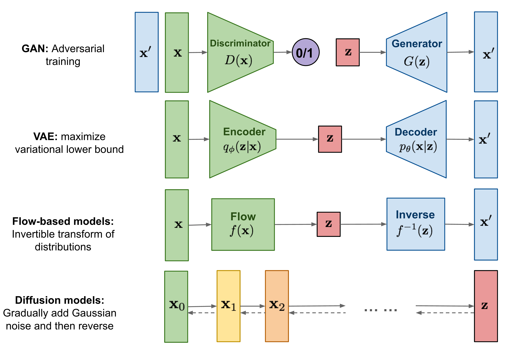
Given a data point sampled from a real data distribution $\mathbf{x}_0 \sim q(\mathbf{x})$, let us define a <em>forward diffusion process</em> in which we add small amount of Gaussian noise to the sample in \(T\) steps, producing a sequence of noisy samples \(\mathbf{x}_1, \dots, \mathbf{x}_T\). The step sizes are controlled by a variance schedule \(\{\beta_t \in (0, 1)\}_{t=1}^t\).
\[q(\mathbf{x}_t \vert \mathbf{x}_{t-1}) = \mathcal{N}(\mathbf{x}_t; \sqrt{1 - \beta_t} \mathbf{x}_{t-1}, \beta_t\mathbf{I}) \quad
q(\mathbf{x}_{1:T} \vert \mathbf{x}_0) = \prod^T_{t=1} q(\mathbf{x}_t \vert \mathbf{x}_{t-1})\]
The data sample \(\mathbf{x}_0\) gradually loses its distinguishable features as the step \(t\) becomes larger. Eventually when \(T \to \infty\), \(\mathbf{x}_T\) is equivalent to an isotropic Gaussian distribution.
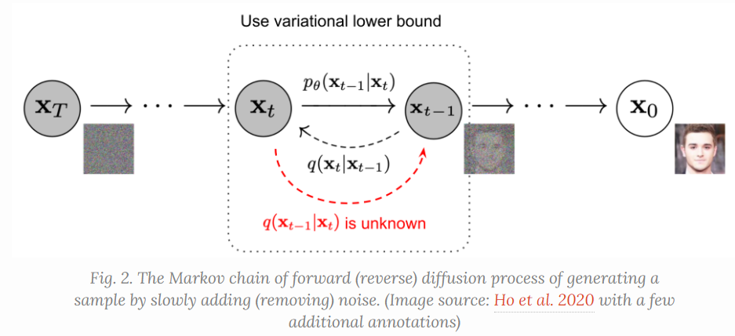

<!-- > **Diffusion Models**
Nichol 和Dhariwal 找到為擴散模型提供最佳樣本質量的模型架構進行一些架構調整。
Jonathan Ho在論文“Denoising diffusion probabilistic models”中引入了U-Net的擴散模型架構，與先前的架構相比，該架構大大提高了樣本質量，用於去噪得分匹配。
模型使用了多個殘差層和下採樣捲積，然後是多個殘差層和上採樣捲積，其中跳過連接將相同尺寸的捲積層連接起來。
此外，他們使用了一個16×16分辨率的單頭全局注意力層，並且在每個殘差塊中添加一個時間步嵌入的投影。
Song等人在ICLR 2021傑出論文“Score-based generative modeling through stochastic differential equations”中，發現對U-Net架構的進一步改進可以提高擴散模型在CIFAR-10和CelebA-64數據集的性能。
研究人員在ImageNet128×128上展示了同樣的結果，發現在更大、更多樣、分辨率更高的數據集上，架構改進確實可以大大提高采樣質量。
Nichol和Dhariwal探討了以下的架構變化：  
增加深度與寬度，保持模型尺寸相對恆定。
增加註意力頭的數量。
使用32×32,16×16和8×8分辨率的注意力，而不僅僅是16×16。
使用BigGAN殘差塊對激活值進行上採樣和下採樣。
參考“Score-based generative modeling through stochastic differential equations”等論文，以1/√2因子重新縮放殘差連接數。
研究者還研究了其他更符合Transformer 架構的注意力配置。將注意力頭固定在一個常數上，或者固定每個頭的通道數。結果表明更多的頭或更少的通道可以改善FID。 -->
## Abstract
1. We show that diffusion models can achieve image sample quality superior to the current state-of-the-art generative models. We achieve this on **unconditional image synthesis** by finding a better architecture through a series of ablations.
2. For **conditional image synthesis**, we further improve sample quality with classifier guidance: a simple, compute-efficient method for trading off diversity for fidelity using gradients from a classifier.
3. We achieve an FID of 2.97 on ImageNet 128×128, 4.59 on ImageNet 256×256, and 7.72 on ImageNet 512×512, and we match BigGAN-deep even with as few as 25 forward passes per sample, all while maintaining better coverage of the distribution.
4. Finally, we find that classifier guidance combines well with **upsampling diffusion models**, further improving FID to 3.94 on ImageNet 256×256 and 3.85 on ImageNet 512×512.
5. We release our code at https://github.com/openai/guided-diffusion.

## Architecture Improvements
>**The UNet architecture for diffusion models**
The UNet model uses a stack of residual layers and downsampling convolutions, followed by a stack of residual layers with upsampling colvolutions, with skip connections connecting the layers with the same spatial size. In addition, they use a global attention layer at the 16×16 resolution with a single head, and add a projection of the timestep embedding into each residual block.
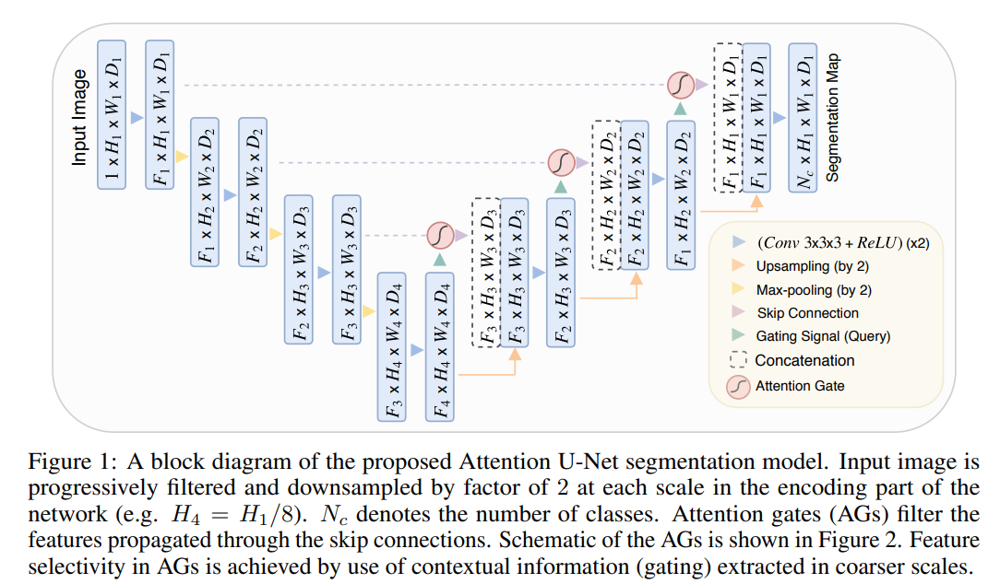

We show the same result on ImageNet 128×128, finding that architecture can indeed give a substantial boost to sample quality on much larger and more diverse datasets at a higher resolution. 
We explore the following architectural changes:
- Increasing depth versus width, holding model size relatively constant. 
- Increasing the number of attention heads.
- Using attention at 32×32, 16×16, and 8×8 resolutions rather than only at 16×16.
- Using the BigGAN residual block for upsampling and downsampling the activations, following.
- Rescaling residual connections with $ 1/ \sqrt2$.

For all comparisons in this section, we train models on ImageNet 128×128 with batch size 256, and sample using 250 sampling steps. We train models with the above architecture changes and compare them on FID, evaluated at two different points of training, in Table 1. 
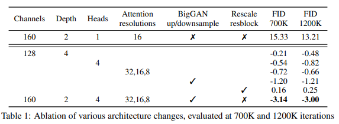

We observe in Figure 2 that while increased depth helps performance, it increases training time and takes longer to reach the same performance as a wider model, so we opt not to use this change in further experiments. In Figure 2, we see 64 channels is best for wall-clock time, so we opt to use 64 channels per head as our default. We note that this choice also better matches modern transformer architectures, and is on par with our other configurations in terms of final FID.
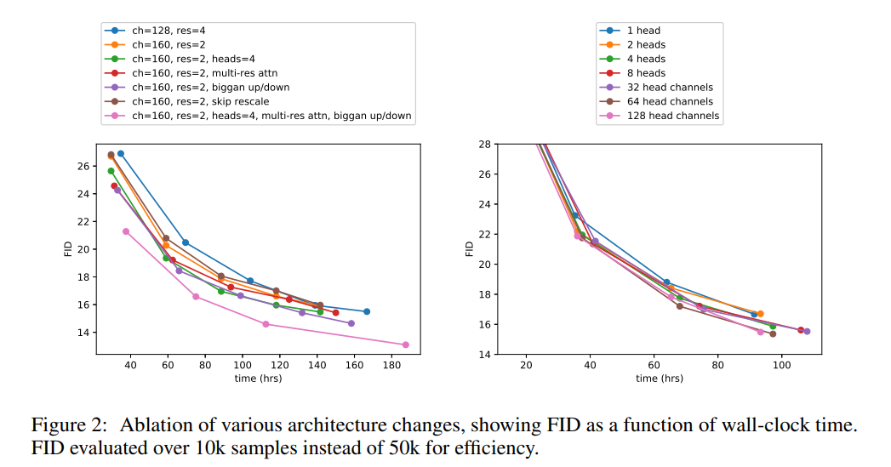

We also study other attention configurations that better match the Transformer architecture. To this end, we experimented with either fixing attention heads to a constant, or fixing the number of channels per head. For the rest of the architecture, we use 128 base channels, 2 residual blocks per resolution, multi-resolution attention, and BigGAN up/downsampling, and we train the models for 700K iterations. Table 2 shows our results, indicating that more heads or fewer channels per head improves FID. 
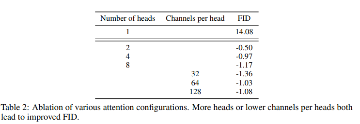

<!-- 
####  Adaptive Group Normalization -->

## Classifier Guidance
In addition to employing well designed architectures, GANs for conditional image synthesis make heavy use of class labels. This often takes the form of class-conditional normalization statistics as well as discriminators with heads that are explicitly designed to behave like classifiers p(y|x). Here, we explore a different approach: exploiting a classifier p(y|x) to improve a diffusion generator.
####  Conditional Reverse Noising Process
We start with a diffusion model with an unconditional reverse noising process $p_{θ}(xt|xt+1)$. To condition this on a label $y$, it suffices to sample each transition according to

where $Z$ is a normalizing constant, we train a classifier $p_{\phi}(y|x_{t}, t)$ on noisy images $x_{t}$, and then use gradients $∇x_{t} log p_{\phi} (y|x_{t}, t)$ to guide the diffusion sampling process towards an arbitrary class label $y$.
<!-- ####  Conditional Sampling for DDIM -->
####  Scaling Classifier Gradients
In initial experiments with unconditional ImageNet models, we found it necessary to scale the classifier gradients by a constant factor larger than 1. When using a scale of 1, we observed that the classifier assigned reasonable probabilities (around 50%) to the desired classes for the final samples, but these samples did not match the intended classes upon visual inspection.

Scaling up the classifier gradients remedied this problem, and the class probabilities from the classifier increased to nearly 100%. Figure 3 shows an example of this effect.
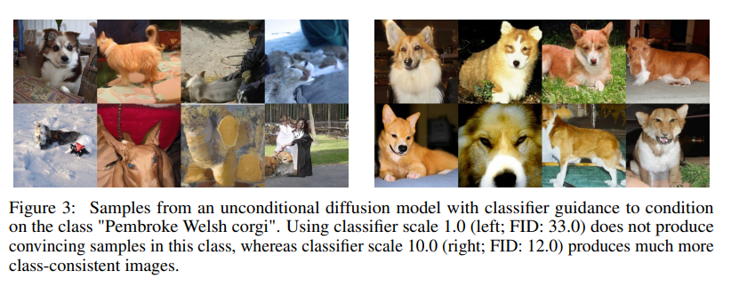

The classifier guidance improves precision at the cost of recall, thus introducing a trade-off in sample fidelity versus diversity. We explicitly evaluate how this trade-off varies with  We see that scaling the gradients beyond 1.0 smoothly trades off recall (a measure of diversity) for higher precision and IS (measures of fidelity).
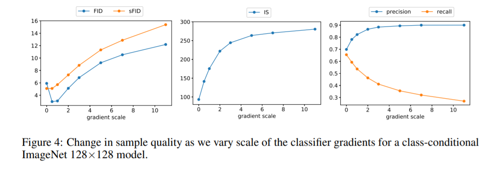

>Finally, Kynkäänniemi et al. proposed Improved **Precision** and **Recall** metrics to separately measure sample fidelity as the fraction of model samples which fall into the data manifold (precision), and diversity as the fraction of data samples which fall into the sample manifold (recall).

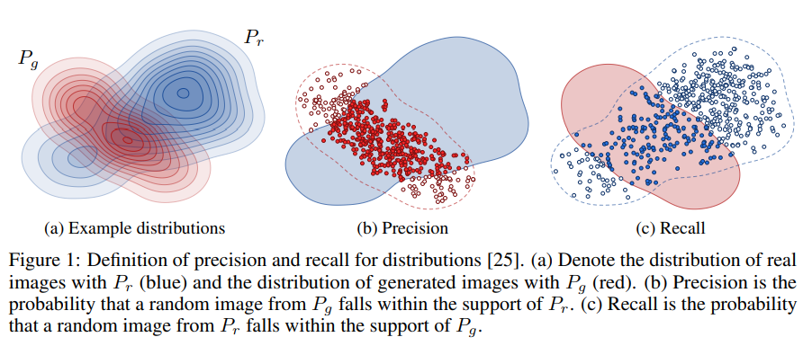

We also compare our guidance with the truncation trick from BigGAN in Figure 5. We find that classifier guidance is strictly better than BigGAN-deep when trading off FID for Inception
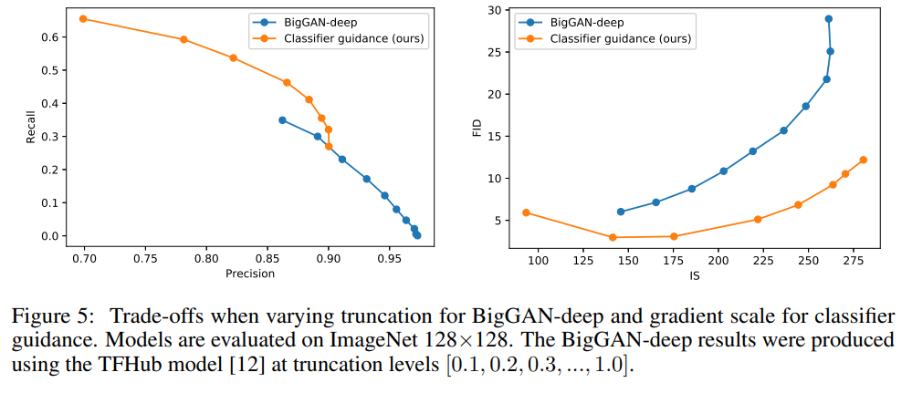

## Result
To evaluate our improved model architecture on unconditional image generation, we train separate diffusion models on three LSUN classes: bedroom, horse, and cat. To evaluate classifier guidance, we train conditional diffusion models on the ImageNet dataset at 128×128, 256×256, and 512×512 resolution. 
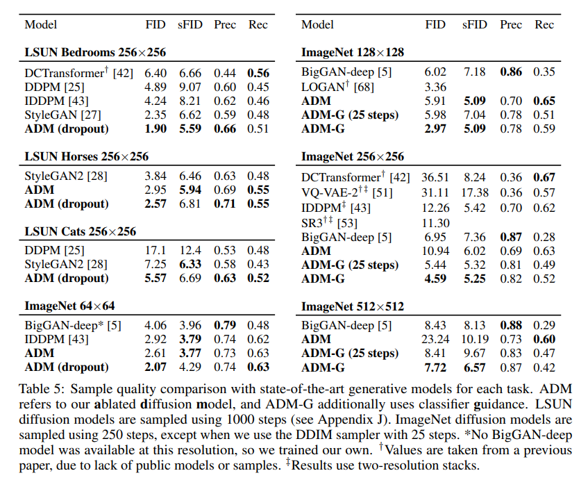
Note: sFID is equivalent to FID but uses intermediate spatial features in the inception network rather than the spatially-pooled features used in standard FID.
<!-- 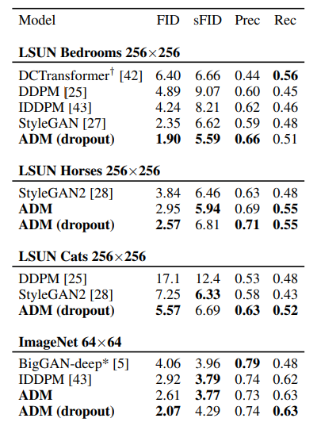 -->

We also compare guidance to using a two-stage upsampling stack. Nichol and Dhariwal and Saharia et al. train two-stage diffusion models by combining a low-resolution diffusion model with a corresponding upsampling diffusion model.
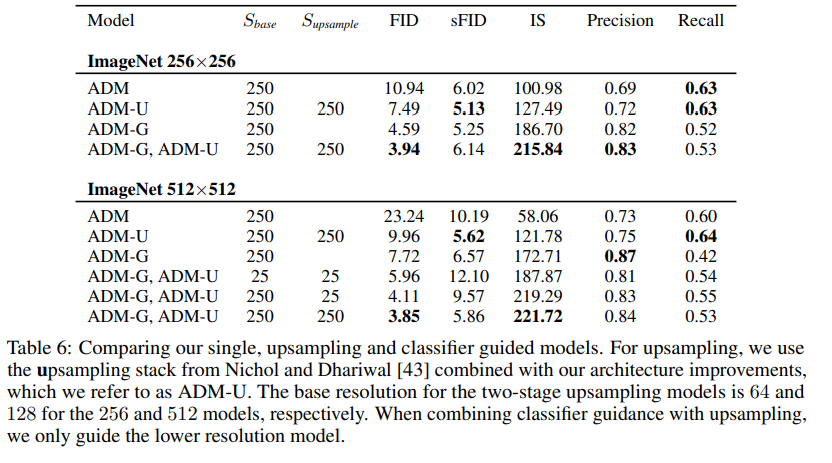

## Appendix 
<!-- 該分數作為對現有的Inception Score（IS）的改進而被提出，目的是基於一組合成圖像的統計量與來自目標域的真實圖像的統計量進行的比較，實現對合成圖像的評估。
Inception 分數基於圖像分類模型Inception v3 對一組合成圖像的分類情況（將其分類為1,000 類對像中的一種）來評估圖像的質量。該分數結合了每個合成圖像的條件類預測的置信度（質量）和預測類別的邊緣概率積分（多樣性）。
與Inception 分數一樣，FID 分數也使用了Inception v3 模型。具體而言，模型的編碼層（圖像的分類輸出之前的最後池化層）被用來抽取輸入圖像的用計算機視覺技術指定的特徵。這些激活函數是針對一組真實圖像和生成圖像計算的。
在數學上，Frechet Distance用於計算兩個“多元”正態分佈之間的距離。對於“單變量”正態分佈，Frechet距離為
在計算機視覺尤其是GAN評估中，我們使用如上所述的特徵距離。我們使用在Imagenet數據集上預先訓練的Inception V3模型。來自Inception V3模型的激活被用來匯總每個圖像，這是為什麼該得分的名稱為“ Frechet Inception Distance”。
此激活來自倒數第二個pooling layer（如果使用TensorFlow，則為Global Average Pooling）。我們假設形狀為（2048，）的輸出向量將通過“多元”正態分佈進行近似。
“多元”正態分佈的Frechet Inception Distance由下式給出： -->

>**IS 介紹**
　　IS基於Google的預訓練網路Inception Net-V3。Inception Net-V3是精心設計的卷積網路模型，輸入為圖片張量，輸出為1000維向量。輸出向量的每個維度的值對應圖片屬於某類的概率，因此整個向量可以看做一個概率分布。下面講解IS的思路和推導過程。
**定義**
IS考慮以下兩個方面評估生成器的品質：
1、對於單一的生成影像，Inception輸出的概率分布熵值應該盡量小。越小說明生成影像越有可能屬於某個類別，影像品質高。
2、對於生成器生成的一批影像而言，Inception輸出的平均概率分布熵值應該盡量大。因為生成器應該保證生成影像的多樣性，因此Inception在不同生成影像上的輸出分布差異應該大一些，從而使得它們的平均更接近均勻分布，熵值更大。
　　1定義如下：
$$\begin{equation} \begin{aligned} &E_{x\sim p_G}(H(p(y|x)))\\ =&\sum\limits_{x\in G}P(x)H(p(y|x))\\ =&\sum\limits_{x\in G}P(x)\sum\limits_{i=1}^{1000}P(y_i|x)\log \frac{1}{P(y_i|x)}\\ \end{aligned} \end{equation}$$
　　即先求批量輸出分布的熵值再求熵的均值。其中$p(y|x)$表示Inception輸入生成影像$x$時的輸出分布，$P(x)$表示生成器$G$生成影像$x$的概率，$P(y_i|x)$表示Inception預測$x$為第$i$類的概率。
　　2定義如下：
$$\begin{equation} \begin{aligned} &H(E_{x\sim p_G}(p(y|x)))\\ =&H\left(\sum\limits_{x\in G} P(x)p(y|x)\right)\\ =&H\left( p(y)\right)\\ =&\sum\limits_{i=1}^{1000} P(y_i)\log \frac{1}{P(y_i)}\\ =&\sum\limits_{i=1}^{1000} \sum\limits_{x\in G}P(y_i,x)\log \frac{1}{P(y_i)}\\ =& \sum\limits_{x\in G}P(x)\sum\limits_{i=1}^{1000}P(y_i|x)\log \frac{1}{P(y_i)}\\ \end{aligned} \end{equation}$$
　　即先求批量輸出分布的均值再求均值的熵。其中$p(y)$表示$G$生成的圖片在Inception輸出類別的平均分布，$P(y_i)$表示Inception判斷$G$生成的圖片屬於$i$類的概率。
　　為了將1和2放在一起作為一個整體，取$(1)$式為負，這樣這兩個指標的優化目標就一致了，都是越大越好。然後將它們加起來，得到：
$$\begin{equation} \begin{aligned} &\sum\limits_{x\in G}P(x)\sum\limits_{i=1}^{1000}P(y_i|x)\log \frac{P(y_i|x)}{P(y_i)}\\ =&E_{x\sim p_G}KL(p(y|x)||p(y)) \end{aligned} \end{equation}$$
　　其中$KL(p(y|x)||p(y))$是這兩個分布的KL散度（相對熵）。最後再加上指數，得到最終的IS：
$$\begin{equation} \begin{aligned}  \text{IS}=\exp E_{x\sim p_G}KL(p(y|x)||p(y)) \end{aligned} \end{equation}$$
　　根據定義，IS值越大，生成影像的品質越高。
>**具體應用**
　　假設生成器$G$生成$n$張圖片$\{x_1,x_2,…,x_n\}$，首先計算$P(y_i)$：
$$\begin{equation} \begin{aligned} P(y_i) = \frac{1}{n}\sum\limits_{j=1}^nP(y_i|x_j) \end{aligned} \end{equation}$$
　　然後代入公式$(4)$計算IS：
$$\begin{equation} \begin{aligned} \text{IS}(G) &=\exp E_{x\sim p_G}KL(p(y|x)||p(y)) \\ &=\exp\left(\sum\limits_{x\in G}P(x)\sum\limits_{i=1}^{1000}P(y_i|x)\log \frac{P(y_i|x)}{P(y_i)}\right)\\ &=\exp\left(\frac{1}{n}\sum\limits_{j=1}^n\sum\limits_{i=1}^{1000}P(y_i|x_j)\log \frac{P(y_i|x_j)}{P(y_i)}\right) \end{aligned} \end{equation}$$

>**FID 介紹**
　　FID分數是在IS基礎上的修改（沒有優劣之分），同樣也是基於Inception Net-V3。FID與IS的不同之處在於，IS是直接對生成影像進行評估，指標值越大越好；而FID分數則是通過對比生成影像與真實影像來產生評估分數，計算一個「距離值」，指標值越小越好。以下是定義。
**定義**
　　FID並不使用Inception Net-V3的原本輸出作為依據，它刪除模型原本的輸出層，於是輸出層變為Inception Net-V3的最後一個池化層。這一層的輸出是2048 維向量，因此，每個影像會被預測為2048個特徵。
　　對於常見的分布來說（比如高斯分布），當分布類型確定後，只要再確定均值和方差，那麼這個分布就確定了。我們假設生成影像與真實影像也服從某類分布，如果它們之間的均值與方差比較相近，我們就有理由認為生成影像是比較真實的。但是直接計算影像的均值和方差是不可取的，因為協方差矩陣規模太大（像素數*像素數）。所以就先通過Inception Net-V3映射為2048維的特徵向量，再求特徵向量的均值與協方差矩陣進行比較(使用 Wasserstein-Distence，又叫做 Frechet Distence )。
　　於是，真實影像分布與生成器生成分布之間的差異，即FID分數，是這樣定義的：
$$\begin{equation} \begin{aligned} \text{FID}(x,g) = \left\|\mu_x – \mu_g\right\| + \text{Tr}\left(\Sigma_x+\Sigma_g-2\sqrt{\Sigma_x\Sigma_g}\right) \end{aligned} \end{equation}$$
　　其中$\mu_x,\Sigma_x$分別是真實影像集合在Inception Net-V3輸出的2048維特徵向量集合的均值和協方差矩陣，$\mu_g,\Sigma_g$分別是生成影像集合在Inception Net-V3輸出的2048維特徵向量集合的均值和協方差矩陣，$\text{Tr}$表示矩陣的跡，開根號是按元素進行的運算。
　　較低的FID意味著生成分布與真實圖片分布之間更接近，如果用於測試的真實圖片清晰度高且種類多樣，也就意味著生成影像的品質高、多樣性好。
>**具體應用**
FID 越低，圖像質量越好；反之，得分越高，質量越差，兩者關係應該是線性的。該分數的提出者表明，當應用系統失真（如加入隨機噪聲和模糊）時，FID 越低，圖像質量越好。
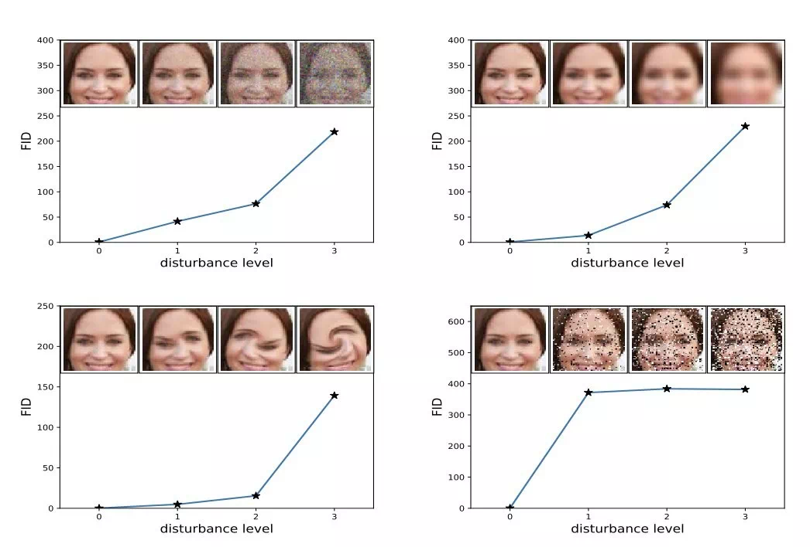

> **Frechet 起始距离(Frechet Inception Distance / FID)**
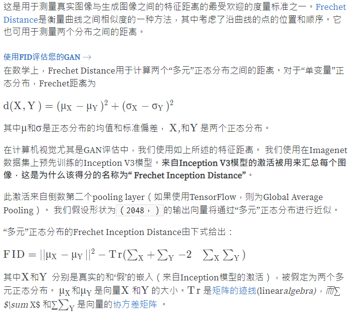

>**擴散模型的發展**
現有的生成建模技術可以基於它們表示概率分佈的方式大致分為兩類。
(1) 第一種是基於 maximum-likelihood (似然)的模型，它通過近似的最大似然直接學習分佈的概率密度(或質量)函數。典型的基於似然的模型包括自回歸模型、歸一化流模型、基於能量的模型(EBMs)和變分自編碼器(VAEs)。
(2) 第二種是 hidden generative model (隱式生成模型)，其中概率分佈是通過採樣過程的模型來隱式表示的。最突出的例子是生成對抗性網絡(GANs) ，它通過將隨機高斯矢量與神經網絡相轉換來合成新的數據分佈樣本。

貝葉斯網絡、馬爾可夫隨機場(MRF)、自回歸模型和歸一化流模型都是基於似然的模型的例子。所有這些模型都表示一個分佈的概率密度或質量函數
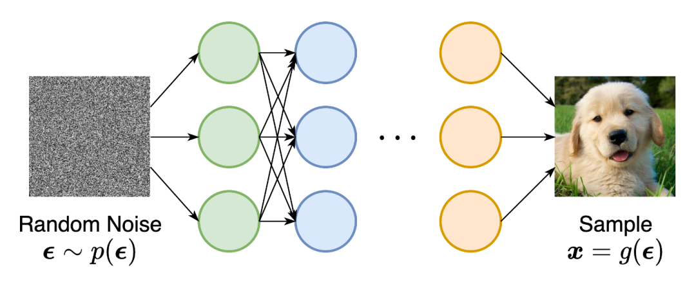
GAN 是隱式模型的一個例子。它隱式地表示生成器網絡可以生成的所有對象的分佈
然而，基於似然的模型和隱式生成模型都有很大的局限性。基於似然的模型要么要求對模型結構有很強的約束，以確保似然計算的可控歸一化常數，要么必須依靠替代目標來近似最大似然訓練。另一方面，隱式生成模型往往需要對抗性訓練，從而存在不穩定性，並可能導致模式崩潰。
基於分數的生成模型與擴散概率模型緊密相連，擴散概率模型是由Jascha Sohl - Dickstein和他的同事首先提出的一種具有多隨機層的VAEs。
去年，Jonathan Ho和他的同事在論文“Denoising diffusion probabilistic models”中指出，用於訓練擴散概率模型的證據下限(ELBO)基本上等同於基於分數的生成模型中的分數匹配目標的混合。此外，通過參數化的解碼器作為一個序列得分為基礎的模型，他們第一次證明擴散模型可以產生高質量的、可媲美GAN的圖像樣本。
擴散模型其與現有的模型相比有幾個重要的優點：沒有對抗性訓練的GAN級樣本質量，靈活的模型架構，精確的對數似然計算，唯一可辨識的表示學習，以及不需要重新訓練模型的逆問題求解。
然而，研究者也指出，目前擴散模型相對於GAN還存在幾個缺點：訓練計算量更大、採樣速度更慢、採樣過程中需要多次前向傳播、在單步模型上遠不如GAN。

> **The residual block of Big-GAN**
In the BigGAN model (Figure 15), we use the ResNet (He et al., 2016) GAN architecture of (Zhang et al., 2018), which is identical to that used by (Miyato et al., 2018), but with the channel pattern in D modified so that the number of filters in the first convolutional layer of each block is equal to the number of output filters (rather than the number of input filters, as in Miyato et al. (2018); Gulrajani et al. (2017)).
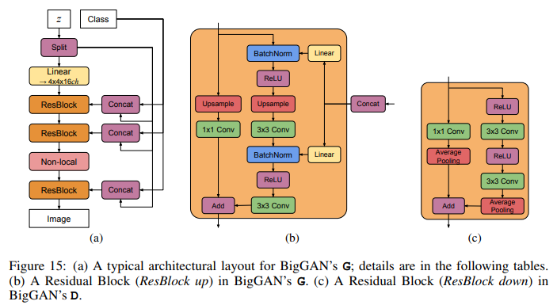

>**Full Architecture**
Finally here is the complete view of the transformer’s architecture:
● Both the source and target sequences first go through embedding layers to produce data of the same dimension \(d_\text{model} =512\).
● To preserve the position information, a sinusoid-wave-based positional encoding is applied and summed with the embedding output.
● A softmax and linear layer are added to the final decoder output.
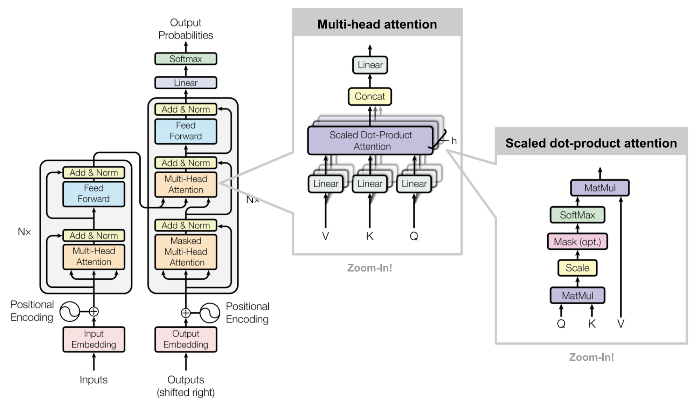
Fig. 17. The full model architecture of the transformer. (Image source: Fig 1 & 2 in Vaswani, et al., 2017.)

>**Reference**
https://medium.com/graphcore/a-new-sota-for-generative-modelling-denoising-diffusion-probabilistic-models-8e21eec6792e
https://cloud.tencent.com/developer/article/1826672