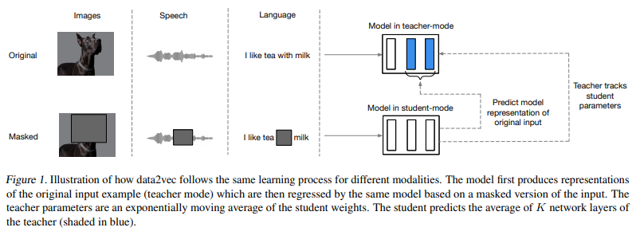
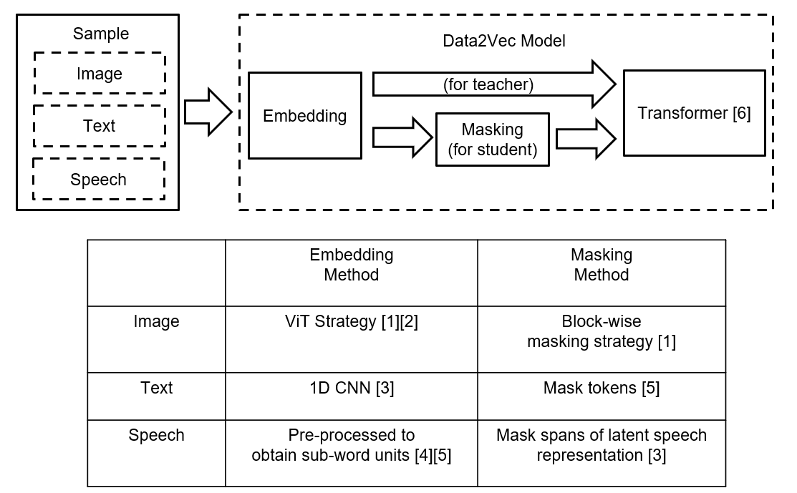
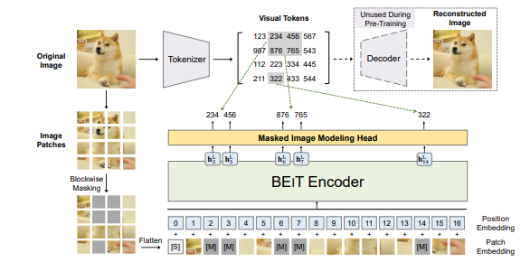
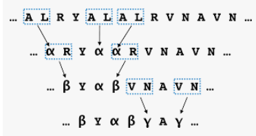
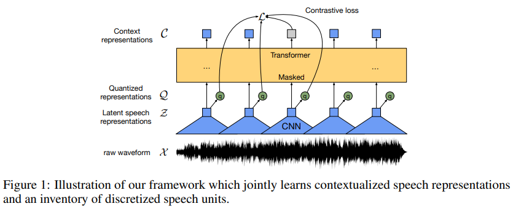
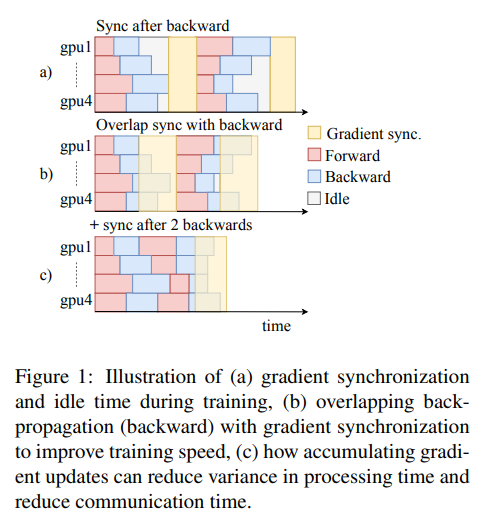
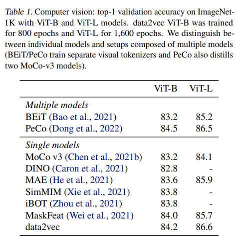
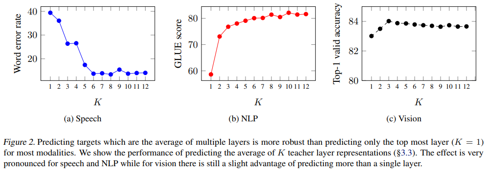
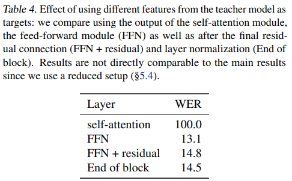

# data2vec: A General Framework for Self-supervised Learning in Speech, Vision and Language

paper: https://arxiv.org/pdf/2202.03555.pdf
reference: [meta AI](https://medium.com/mlearning-ai/interpretation-of-data2vec-a-general-framework-for-self-supervised-learning-in-speech-vision-and-43299fef41d4)

## Abstract
The core idea is to predict **latent representations** of the full input data based on a **masked view** of the input in a self-distillation setup using a standard Transformer architecture.

Instead of predicting ~~modality-specific targets such as words~~, ~~visual tokens~~ or ~~units of human speech which are local in nature~~, data2vec predicts **contextualized latent representations** that contain information from the entire input.

## Method
We first **encode a masked version of the training sample** (model in student mode) and then **construct training targets by encoding the unmasked version** of the input with the same model but when parameterized as an exponentially moving average of the model weights.

The target representations encode all of the information in the training sample and the **learning task** is for the student to predict these representations given a partial view of the input.

#### Model architecture

###### Image
We follow **BEiT** (Bao et al., 2021) by masking blocks of multiple adjacent patches where each block contains at least 16 patches with a random aspect ratio. Different to their work, we found it more accurate to **mask 60%** of the patches instead of 40%. We use randomly applied resized image crops, horizontal flipping, and color jittering (Bao et al., 2021). We use the same modified image both in teacher mode and student mode.
>BEiT

###### Text
We build on the BERT re-implementation **RoBERTa** (Liu et al., 2019) available in fairseq (Ott et al., 2019). The input data is tokenized using a **byte-pair encoding** (Sennrich et al., 2016) of 50K types and the model learns an embedding for each type (Devlin et al., 2019; Liu et al., 2019) Once the data is embedded, we apply the **BERT masking strategy** to 15% of uniformly selected tokens: 80% are replaced by a learned mask token, 10% are left unchanged and 10% are replaced by randomly selected vocabulary token; we do not use the next-sentence prediction task. We also consider the wav2vec 2.0 strategy of masking spans of four tokens.
> byte-pair encoding:

###### Speech
Models are implemented in **fairseq** (Ott et al., 2019) and take as input 16 kHz waveform which is processed by a feature encoder (**wav2vec 2.0**, Baevski et al., 2020b) containing seven temporal convolutions with 512 channels, strides (5,2,2,2,2,2,2) and kernel widths (10,3,3,3,3,2,2). This results in an encoder output frequency of 50 Hz with a stride of about 20ms between each sample, and a receptive field of 400 input samples or 25ms of audio. The raw waveform input to the encoder is normalized to zero mean and unit variance.

The masking strategy for the Base model is also identical to Baevski et al. (2020b): we sample p = 0.065 of all time-steps to be starting indices and mask the subsequent ten time-steps. This results in approximately 49% of all time-steps to be masked for a typical training sequence.
>  wav2vec 2.0

> fairseq

#### Training targets
- The representations we predict are **contextualized representations**, encoding the particular time-step but also other information from the sample due to the use of self-attention in the Transformer network.

- The encoding of the unmasked training sample is parameterized by an **exponentially moving average** (EMA) of the model parameters where the weights of the model in target-mode $\varDelta$ are:
, 
We use a schedule for $τ$ that linearly increases.

- Training targets are constructed **based on the output of the top $K$ blocks** of the teacher network for time-steps which are masked in student-mode. The output of block $l$ at time-step $t$ is denoted as $a^{l}_{t}$. We apply a normalization to each block to obtain $a^{l}_{t}$ before averaging the top $K$ blocks  for a network with $L$ blocks in total to obtain the training target $y_{t}$ for time-step $t$.

#### Objective
- Given contextualized training targets $y_{t}$, we use a Smooth $L_{1}$ loss to regress these targets:

where $β$ controls the transition from a squared loss to an $L_{1}$ loss, depending on the size of the gap between the target $y_{t}$ and the model prediction $f_{t}(x)$ at time-step $t$.

- The advantage of this loss is that it is less sensitive to outliers, however, we need to tune the setting of $β$.

## Results
#### Computer vision

#### Speech processing

#### Natural language processing

#### Ablations
###### Layer-averaged targets

###### Target feature type

We believe this is because the self-attention output is before the residual connection and features are heavily biased towards other time-steps.